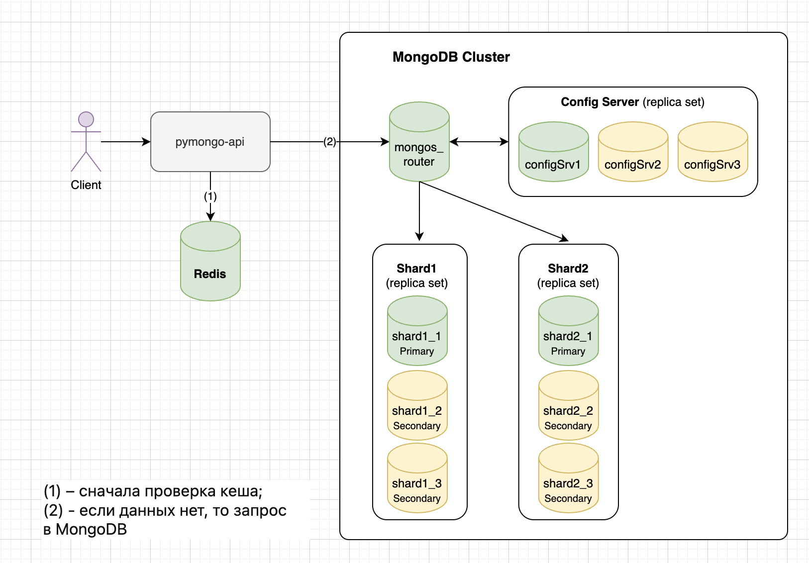
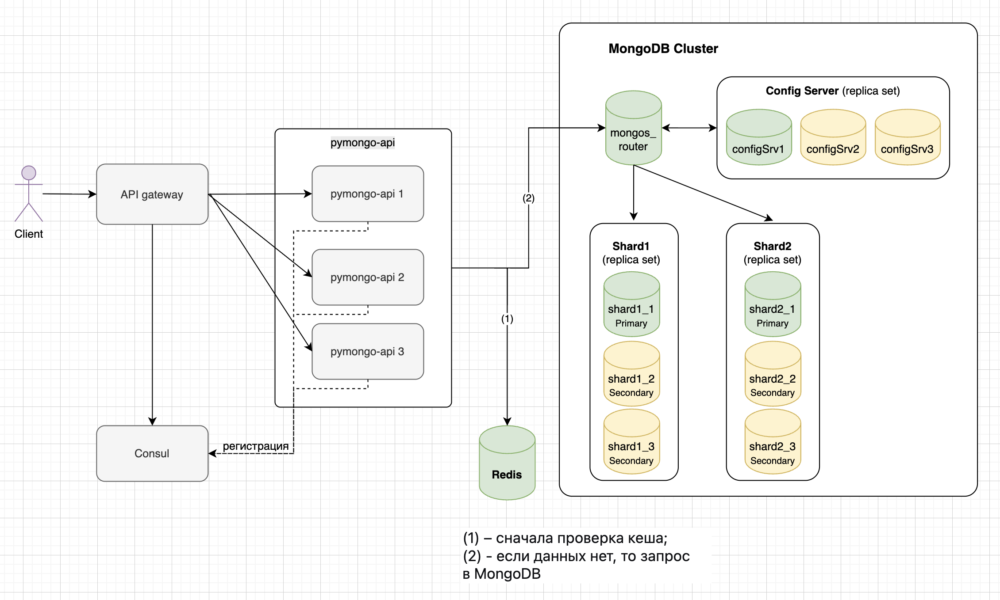
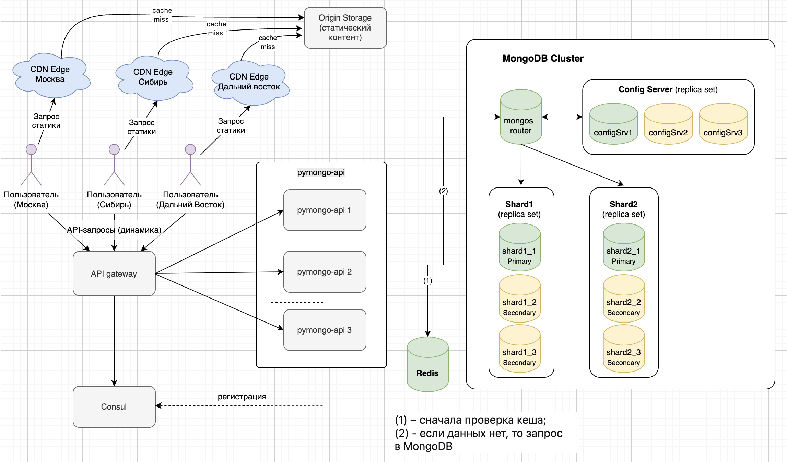

# Задание 1. Планирование



# Задание 5. Service Discovery и балансировка с API Gateway



# Задание 6. CDN



# Задание 7. Проектирование схем коллекций для шардирования данных

## Введение

Необходимо спроектировать схемы для трёх коллекций MongoDB: `orders`, `products`, `carts`. 

База данных: `mobile_world`

---

## 1. Коллекция `orders`

### Назначение

Хранение информации о заказах клиентов: состав заказа, статус, сумма, геозона доставки.

### Схема документа

```
{
  _id: ObjectId,                  // уникальный идентификатор заказа
  user_id: string,                // идентификатор клиента
  order_date: ISODate,            // дата и время оформления
  items: [                        // список товаров (денормализация - category)
    {
      product_id: ObjectId,
      quantity: number,              // количество товаров
      category: string,           // категория товара на момент покупки - если нужен быстрый переход от заказа к товару
      price: number
    }
  ],
  status: string,                 // "new", "paid", "shipped", "delivered", "cancelled"
  total_sum: number,              // общая сумма заказа
  geo_zone: string                // код геозоны (msk, spb, ekb, ...)
}
```

### Основные операции

- **Быстрое создание заказов с одновременным списанием остатков** - `insertOne` с транзакционным списанием остатков.
```javascript
// В транзакции :
db.orders.insertOne({ 
  user_id: "123", 
  order_date: new Date(), 
  items: [{ product_id: ObjectId("..."), category: "electronics", price: 100 }], 
  status: "new", 
  total_sum: 100, 
  geo_zone: "msk" 
 });
 
db.products.updateOne(
  { _id: ObjectId("..."), category: "electronics" }, 
  { $inc: { "stock.msk": -1 } }
);
```

- **Поиск истории заказов конкретного пользователя** - `find({ user_id: X })`, часто с сортировкой по `order_date`.
```javascript
db.orders.find({ user_id: "123" }).sort({ order_date: -1 })
```

- **Отображение статуса заказа** - `findOne({ _id: X })`
```javascript
db.orders.findOne({ _id: ObjectId("..."), user_id: "123" })
```

### Выбор шард-ключа

**Шард-ключ**: `{ user_id: "hashed" }` \
**Стратегия**: хэшированное шардирование

#### Обоснование

- **Равномерное распределение нагрузки при вставке.** Создание заказов – операция с высокой интенсивностью (особенно в чёрную пятницу). Хэш-функция от `user_id` равномерно распределяет новые заказы по всем шардам, предотвращая появление горячей точки записи. Это критически важно для масштабирования: можно добавлять новые шарды, не перераспределяя существующие данные.
- **История заказов пользователя.** При хэш-шардировании по `user_id` все заказы одного пользователя гарантированно попадают на один шард. `Mongos` направляет запрос на единственный шард, исключая `scatter-gather`, что даёт минимальную задержку и высокую пропускную способность даже при огромном количестве пользователей.
- **Индексация.** Рекомендуемый индекс для ускорения сортировки истории по дате создания заказа: `{ user_id: 1, order_date: -1 }`.
- **Статус заказа по `_id`.** Рекомендуется передавать `user_id` вместе с `_id`: `findOne({ _id: X, user_id: Y })`. Тогда `mongos` вычисляет хэш от `user_id` и направляет запрос на нужный шард.

**Денормализация `category` в `items`** позволяет:
- строить URL на карточку товара с категорией (`/products/{category}/{product_id}`), что обеспечивает маршрутизацию запроса товара на нужный шард.
- позволяет быстро подсчитать выручку по категориям за период, выполнив агрегацию по `items.category` в коллекции `orders`. При этом не требуется `$lookup` (`JOIN`) с коллекцией `products`, который в шардированной среде был бы крайне дорогим (`scatter-gather` + возможные перекосы).

```javascript
// Включить шардирование для базы данных (если ещё не включена)
sh.enableSharding("mobile_world");

// Шардировать коллекцию orders по хэшу user_id
sh.shardCollection("mobile_world.orders", { user_id: "hashed" });

// Составной индекс для ускорения сортировки истории заказов по дате
db.orders.createIndex({ user_id: 1, order_date: -1 });
```

#### Риски

**Перекос данных из-за сверхактивного пользователя (B2B-клиент).** Крупный оптовый клиент может делать десятки тысяч заказов в день. При шардировании по `user_id` все эти заказы окажутся на одном шарде, что приведёт к:
- неравномерному распределению данных по кластеру;
- перегрузке этого шарда по объёму хранилища и операциям ввода-вывода;
- замедлению обработки запросов для этого пользователя и для других, чьи данные оказались на том же шарде.

**Смягчение:**
- Выделенный шард для "китов": определить top-крупных клиентов и размещать их заказы на отдельном, более мощном шарде или на отдельном кластере. Это можно сделать через специальную маршрутизацию на уровне приложения (например, отдельный `mongos` или логика определения `user_id` с префиксом).
- Составной шард-ключ: добавить в ключ поле `order_date` (например, `{ user_id: "hashed", order_date: 1 })`, но это усложнит запросы).
- Мониторинг и ручное вмешательство: отслеживать размеры чанков и при превышении порога вручную делить чанк по диапазону `_id` (сложно, но возможно).

В большинстве интернет-магазинов B2C такой риск не критичен – у пользователей обычно десятки-сотни заказов, не миллионы.

**Невозможность изменить `user_id` после создания заказа.** Шард-ключ `user_id` неизменяем. Если бизнес-процесс требует передать заказ другому пользователю (например, ошибочное оформление, смена владельца корзины), прямое обновление невозможно. Потребуется:
- удалить документ заказа;
- вставить новый с другим `user_id`. Это дорого, требует транзакции и может нарушить ссылочную целостность (например, номера заказов в логах).

**Смягчение:**

- Процессный подход: проектировать бизнес-логику так, чтобы `user_id` заказа никогда не менялся. Если нужна переуступка, создавать новый заказ (копию) для нового пользователя, а старый аннулировать с пометкой status: "cancelled" и ссылкой на новый заказ.
- Использовать внешний идентификатор: хранить `order_number` (гарантированно уникальный) и при необходимости делать переназначение через отдельную таблицу связей, а `user_id` не трогать.
- Принять как ограничение: изменение владельца заказа – крайне редкая операция, её можно выполнять администратором через отдельный скрипт с удалением/вставкой.

**Broadcast-запросы при получении статуса заказа без `user_id`.** Если клиент переходит на страницу статуса заказа по прямой ссылке из email или SMS, где указан только `_id` (или номер заказа, но не `user_id`), то `mongos` не может определить шард и отправляет запрос на все шарды. Это создаёт дополнительные сетевые вызовы и нагрузку. При высокой частоте (например, внешний сервис делает запрос статуса заказа) может стать проблемой.

**Смягчение:**
- Включать `user_id` в ссылки: формировать URL вида `/orders/status/{user_id}/{order_id}`. В email и push-уведомлениях использовать такой формат.
- Использовать secondary-запрос: при отсутствии `user_id` сначала сделать запрос по `_id` (broadcast) для получения `user_id`, затем следующий запрос уже направлять точно. Но это удваивает задержку.
- Инвертированный маршрут: хранить отдельную "распределённую" таблицу соответствия `_id` -> `user_id`, но она будет такой же большой, как таблица `orders`. Не рекомендуется.
- Кешировать статус: после первого broadcast-запроса закешировать результат (в Redis например) на минуты, чтобы последующие запросы по тому же `_id` отдавать из кеша.

**Увеличение размера документа из-за денормализации `category`.** Хранение категории в каждом элементе `items` увеличивает размер заказа примерно на 10–20 байт на товар. При типичных 5–10 товарах в заказе это незначительно. Но если заказы могут содержать сотни позиций (B2B), накладные расходы станут заметны.

**Смягчение:**
- Ограничение на количество позиций: на уровне бизнеса установить максимум (например, не более 50 позиций в одном заказе).
- Сжатие данных: включить сжатие в MongoDB (`snappy` или `zstd`) – оно уменьшит избыточность.
- Альтернатива без денормализации: можно хранить только `product_id`, а при отображении заказа делать batch-запрос к `products` для получения категорий. Это увеличит сетевые вызовы и задержку (один дополнительный запрос на каждый заказ или пачку товаров). Хранение категории в заказе позволяет избежать этого запроса и гарантирует целевую маршрутизацию при клике на товар.

**Согласованность остатков и заказов (транзакции)** При создании заказа нужно одновременно вставить запись в `orders` и уменьшить остатки в `products` (в поле `stock.geo_zone`). Если коллекции шардированы по разным ключам (в `products` – `category`, в `orders` – `user_id`), то это транзакция через разные шарды (distributed transaction). MongoDB поддерживает такие транзакции, но они медленнее и имеют ограничения по времени выполнения (по умолчанию 60 секунд).

**Смягчение:** Через event sourcing: не обновлять остатки сразу, а создавать событие "заказ создан", которое асинхронно применяется к остаткам. Риск – `overselling`, требует компенсирующих транзакций.

---

## 2. Коллекция `products`

### Назначение

Хранение информации о товарах, их категориях, ценах, остатках по геозонам, дополнительных атрибутах.

### Схема документа

```
{
  _id: ObjectId,                 // уникальный идентификатор товара
  name: string,                  // наименование
  category: string,              // категория (например, "electronics", "books")
  price: number,                 // цена в рублях
  stock: {                       // остатки по геозонам
    msk: number,
    spb: number,
    ekb: number,
    ...
  },
  attributes: {                  // дополнительные атрибуты
    color: string?,
    size: string?,
    brand: string?,
    ...
  }
}
```

### Основные операции

- **Частые обновления остатков при покупках** - `updateOne` по `_id` с модификацией `stock.geo_zone`.
```javascript
db.products.updateOne(
  { _id: ObjectId("..."), category: "electronics" }, // category для маршрутизации на шард
  { $inc: { "stock.msk": -1 } }                     // уменьшить остаток в Москве на 1
);
```
- **Поиск товаров по категориям и фильтрация по диапазону цен** - `find({ category: "...", price: { $gte: ... } })`
```
db.products.find(
  { category: "electronics", price: { $gte: 10000, $lte: 50000 } }
).sort({ price: 1 });
```
- **Описание товара на странице продукта** - `findOne({ _id: ... })`
```javascript
db.products.findOne(
  { _id: ObjectId("..."), category: "electronics" } // category для точечной маршрутизации
);
```

### Выбор шард-ключа

**Шард-ключ**: `{ category: "hashed" }` \
**Стратегия**: хэшированное шардирование

#### Обоснование

- **Обновления остатков товара по `_id`** – операция обновления стоков товара по идентификатору товара. При хэш-шардировании по полю `category` все документы с одинаковым значением категории имеют одинаковый хэш, поэтому гарантированно попадают на один и тот же шард. При обновлении стоков включаем категорию товара `category` в фильтр: `{ _id: ..., category: ... }`, тогда `mongos` сможет направить запрос на конкретный шард.
- **Запросы товаров по категории и фильтрация по диапазону цен** – выборка товаров из одной категории (часто с фильтрацией по цене). Запрос `{ category: "electronics" }` будет маршрутизироваться `mongos` на конкретный шард. Также стоит добавить индекс `{ category: 1, price: 1 }` для ускорения фильтрации и сортировки по цене.
- **Запросы описания товара по `_id`** - рекомендуется включать `category` в запрос товара по `_id` для того, чтобы запрос сразу попадал на конкретный шард.
- **Равномерное распределение нагрузки** – хэш-функция равномерно распределяет различные значения категорий по шардам. Даже если категорий немного (например, 15), хэши от них будут распределены по диапазону, и каждая категория попадёт на свой шард (или несколько категорий на один шард).
```javascript
// Шардировать коллекцию products по хэшу category
sh.shardCollection("mobile_world.products", { category: "hashed" });

// Составной индекс для ускорения фильтрации по категории + цене
db.products.createIndex({ category: 1, price: 1 });
```

#### Риски

**Перекос данных из-за доминирующей категории** - если одна категория (например, electronics) содержит значительно больше документов, чем все остальные, то все эти документы попадут на один шард. Это приведёт к:
  - неравномерному распределению данных по кластеру; 
  - перегрузке этого шарда по объёму хранилища и операциям ввода-вывода; 
  - замедлению запросов к "горячей" категории, так как нагрузка ложится на единственный узел.

**Смягчение:** 
- Выделить для "жирной" категории отдельный dedicated-шард или использовать диапазонное шардирование с композитным ключом (например, `{ category: 1, _id: 1 }`), чтобы чанки категории разбивались по диапазонам `_id`.
- Применить составной шард-ключ `{ category: 1, price: 1 }` (диапазонный), чтобы документы одной категории распределялись по чанкам в зависимости от цены.

**Невозможность изменить категорию товара** (или дороговизна операции) - поле `category` является частью шард-ключа. В MongoDB шард-ключ иммутабелен после вставки документа. Если товар изменил категорию, то обновление `category` потребует удаления документа и вставки заново (или использования `replaceOne` с удалением старого и вставкой нового). Это:
  - сложная операция, требующая транзакции, если нужно сохранить историю;
  - снижает производительность массовых обновлений.

**Смягчение:**
- Проектировать бизнес-процессы так, чтобы категория товара не менялась (или менялась крайне редко).
- Вместо физического изменения категории вводить новое поле `old_category` или использовать флаг `moved_to_new_category`, оставляя исходное category как часть ключа.

---

## 3. Коллекция `carts`

### Назначение

Хранение текущих активных корзин (для гостей и авторизованных пользователей) с возможностью автоматической очистки устаревших корзин по TTL.

### Схема документа

```
{
  _id: ObjectId,                     // уникальный идентификатор корзины
  user_id: string,                   // идентификатор пользователя (null для гостей)
  session_id: string,                // идентификатор сессии (для гостей обязателен)
  shard_key: string,                 // искусственный ключ для шардирования: 
                                     //   "user:<user_id>" для авторизованных
                                     //   "session:<session_id>" для гостей
  items: [
    {
      product_id: ObjectId,
      quantity: number
    }
  ],
  status: string,                    // "active", "ordered", "abandoned"
  created_at: ISODate,
  updated_at: ISODate,
  expires_at: ISODate                // для TTL-индекса (автоматическое удаление)
}
```

### Основные операции

- **Создание корзины `insertOne`**
    - При первом визите гостя создаётся новая корзина с `session_id`, `shard_key = "session:<id>"`, `status = "active"`, `items = []`, заполняются `created_at`, `updated_at`, `expires_at` (TTL). 
    - При регистрации или первом входе пользователя создаётся корзина с `user_id`, `shard_key = "user:<id>"`, аналогичные поля.
```javascript
// Гость
db.carts.insertOne({ 
  user_id: null, 
  session_id: "abc123", 
  shard_key: "session:abc123", 
  items: [], 
  status: "active", 
  created_at: new Date(),
  updated_at: new Date(), 
  expires_at: new Date(Date.now() + 7*24*3600*1000)     // 1 неделя
});

// Пользователь
db.carts.insertOne({ 
  user_id: "123", 
  session_id: null, 
  shard_key: "user:123", 
  items: [], 
  status: "active", 
  created_at: new Date(), 
  updated_at: new Date(), 
  expires_at: new Date(Date.now() + 7*24*3600*1000)   // 1 неделя
});
```

- **Получение активной корзины:**
    - Выполняется поиск активной корзины по `shard_key` и `status = "active"`. 
    - Для гостя параметр `shard_key` формируется на основе `session_id`, для пользователя – на основе `user_id`.
```javascript
// Для гостя
db.carts.findOne({ shard_key: "session:abc123", status: "active" });

// Для пользователя
db.carts.findOne({ shard_key: "user:123", status: "active" });
```

- **Добавление/обновление товара в корзине:**
    - Находим активную корзину по `shard_key`.
    - Если товар уже есть в массиве `items`, увеличиваем `quantity`; если нет – добавляем новый элемент `{ product_id, quantity: 1 }`.
    - Обновляем `updated_at` и сдвигаем `expires_at` (продлеваем жизнь корзины).
```javascript
// Увеличить количество, если товар уже есть
db.carts.updateOne(
  { shard_key: "user:123", status: "active", "items.product_id": ObjectId("...") },
  { $inc: { "items.$.quantity": 1 }, $set: { updated_at: new Date() } }
);
// Если нет — добавить новый элемент (проще отдельным запросом с $push)
```

- **Удаление товара из корзины:**
    - По `shard_key` находим активную корзину.
    - Уменьшаем `quantity` или полностью удаляем элемент из массива, если количество становится 0.
    - Также обновляем `updated_at` и `expires_at`.
```javascript
// Уменьшить quantity на 1, если текущее quantity > 1
db.carts.updateOne(
  { shard_key: "user:123", status: "active" },
  { $inc: { "items.$[elem].quantity": -1 }, $set: { updated_at: new Date() } },
  { arrayFilters: [ { "elem.product_id": ObjectId("..."), "elem.quantity": { $gt: 1 } } ] }
);

// Удалить товар, если его quantity == 1 (т.е. после уменьшения станет 0)
db.carts.updateOne(
  { shard_key: "user:123", status: "active" },
  { $pull: { items: { product_id: ObjectId("..."), quantity: 1 } }, $set: { updated_at: new Date() } }
);
```

- **Слияние гостевой корзины в пользовательскую (при логине)** –
    - Находим активную гостевую корзину по `shard_key = "session:<id>"`. 
    - Затем находим (или создаем, если отсутствует) активную пользовательскую корзину по `shard_key = "user:<id>"`. 
    - Товары из гостевой корзины добавляем в пользовательскую: если товар уже был – увеличивается `quantity`, иначе – добавляется новый элемент. 
    - Гостевая корзина помечается `status = "abandoned"` и не удаляется сразу (сохраняется для истории). 
    - Операция выполняется в распределённой транзакции, так как затрагивает два документа с разными `shard_key`.
```javascript
// Найти гостевую корзину
let guest = db.carts.findOne({ shard_key: "session:abc123", status: "active" });

// Найти или создать пользовательскую активную корзину
let userCart = db.carts.findOneAndUpdate(
  { shard_key: "user:123", status: "active" },
  {
    $setOnInsert: {
      user_id: "123", 
      session_id: null, 
      items: [],
      created_at: new Date(), 
      updated_at: new Date(),
      expires_at: new Date(Date.now() + 7*24*3600*1000)
    }
  },
  { upsert: true, returnDocument: "after" }
);

// Объединить товары: для каждого товара гостевой корзины увеличить количество в пользовательской

// Пометить гостевую корзину как abandoned
db.carts.updateOne({ _id: guest._id }, { $set: { status: "abandoned" } });
```

- **Отметка корзины как заказанной**`
    - После успешного оформления заказа корзина с `shard_key = "user:<id>"` и `status = "active"` обновляется: `status = "ordered"`, `updated_at = <текущее время>`, `expires_at` можно установить на немедленное удаление (или оставить исходное).
```javascript
db.carts.updateOne(
  { shard_key: "user:123", status: "active" },
  { $set: { status: "ordered", updated_at: new Date(), expires_at: new Date() } }
);
```

- **Автоматическая очистка неактивных корзин**
    - База данных автоматически удаляет документы, у которых поле `expires_at` меньше текущего времени (TTL-индекс). 
    - Корзины со статусом `"abandoned"` или `"ordered"` также удаляются по истечении заданного срока, если они не нужны для аналитики.
```javascript
// TTL-индекс (создаётся один раз)
db.carts.createIndex({ expires_at: 1 }, { expireAfterSeconds: 0 });
```

### Выбор шард-ключа

**Шард-ключ:** { shard_key: "hashed" } \
**Стратегия:** хэшированное шардирование

#### Обоснование

**Проблема двух типов идентификаторов** – требуется поддержки поиска корзины как по `user_id` (для авторизованных), так и по `session_id` (для гостей). Если выбрать шард-ключ по `user_id`, то все гости (`user_id = null`) попадут на один шард -> перекос и "горячая точка" для гостевых корзин. Если выбрать шард-ключ по `session_id`, то запросы авторизованных пользователей (по `user_id`) будут broadcast, что неэффективно. \
**Решение** – ввести искусственное поле `shard_key`:
  - Для авторизованного пользователя: `shard_key = "user:" + user_id`
  - Для гостя: `shard_key = "session:" + session_id`

Это гарантирует:
  - Уникальность и равномерное распределение – хэш от `shard_key` даёт хорошее распределение любых идентификаторов. 
  - Точечные запросы – и пользователь, и гость всегда знают свой `shard_key`. Запрос `findOne({ shard_key: X, status: "active" })` точно направляется на один шард. 

**Слияние корзин** – при логине гость имеет `shard_key = "session:abc".` После авторизации создаётся новая корзина с `shard_key = "user:123"`, а старая помечается `"abandoned"`. Операции выполняются по разным шард-ключам, что естественно.

```javascript
// Шардирование
sh.enableSharding("mobile_world");
sh.shardCollection("mobile_world.carts", { shard_key: "hashed" });

// Уникальный индекс для активной корзины
db.carts.createIndex(
  { shard_key: 1, status: 1 },
  { partialFilterExpression: { status: "active" }, unique: true }
);

// TTL-индекс – автоматическое удаление по expires_at
db.carts.createIndex({ expires_at: 1 }, { expireAfterSeconds: 0 });

// Индекс для поиска по user_id / session_id (не для шардирования, а для fallback)
db.carts.createIndex({ user_id: 1 });
db.carts.createIndex({ session_id: 1 });
```

#### Риски

**Избыточность данных.** Хранение `shard_key` дублирует информацию из `user_id` / `session_id`. Это увеличивает размер документа, но незначительно (примерно на 20–30 байт). Приемлемо. \

**Необходимость поддержки двух полей в коде приложения** При каждом обращении к корзине приложение должно знать `shard_key`. Для гостя – это `"session:" + session_id`, для пользователя – `"user:" + user_id`. Требуется аккуратность при формировании запросов. \
**Смягчение:** обернуть в функции `getCart(shard_key)`.

**Слияние корзин требует транзакции на разных шард-ключах.** Гостевая корзина (`shard_key = session:...`) и пользовательская (`shard_key = user:...`) могут лежать на разных шардах. Операция слияния (чтение гостевой + обновление пользовательской + пометка гостевой) – это распределённая транзакция. \
**Смягчение:** Принимаем редкие сценарии (логин гостя) как допустимые для распределённой транзакции.

**Ошибочное создание двух активных корзин для одного владельца** При отсутствии уникального индекса возможно случайное создание двух активных корзин с одинаковым `shard_key`. \
**Смягчение:** создать уникальный частичный индекс `{ shard_key: 1, status: 1 }` с условием `{ status: "active" }`. Это гарантирует, что у каждого владельца не более одной активной корзины.

**Перекос гостевых корзин, если `session_id` распределены неравномерно** Хэш от session_id даёт хорошее распределение, но если в системе генерируются предсказуемые или короткие session_id, возможен перекос. \
**Смягчение:** использовать криптостойкие генераторы случайных сессий (например, UUID v4).

# Задание 8. Выявление и устранение "горячих" шардов

## Проблема
В коллекции `products` используется хэш-шардирование по полю `category`. Это привело к тому, что все документы категории "Электроника" (70% запросов) попали на один шард, создав его перегрузку. При хэш-шардировании балансировщик не может автоматически перенести часть документов одной категории на другой шард, так как хэш от одинакового значения всегда одинаков. Поэтому нужны специальные метрики для обнаружения перекоса и механизмы для устранения "горячей" точки.

## Метрики мониторинга состояния шардов

### 1. Распределение данных (объём, количество документов, чанки)

| Метрика                              | Способ получения                                                                                                                | Индикатор перекоса                                                                                                   |
|--------------------------------------|---------------------------------------------------------------------------------------------------------------------------------|----------------------------------------------------------------------------------------------------------------------|
| Количество документов на шард        | `db.collection.getShardDistribution()` (текстовый вывод - поле `docs`) или `db.products.stats().count` на каждом шарде          | Если на одном шарде документов в 2+ раз больше, чем на другом — это перекос.                                         |
| Несжатый размер данных (dataSize)    | `db.collection.getShardDistribution()` (текстовый вывод - поле `data`) или `db.products.stats().size` на каждом шарде           | Аналогично, если на одном шарде size в 2+ раза больше, чем на другом — перекос.                                      |
| Размер данных на диске (storageSize) | `db.products.stats().storageSize` на каждом шарде                                                                               | Аналогично, если разница в в 2+ раза больше - перекос.                                                               |
| Количество чанков на шард            | `db.collection.getShardDistribution()` (текстовый вывод - поле `chunks`) или `sh.status(true)` -> `chunkMetadata` для коллекции | Нормой считается разница не более чем в 1-2 чанка при общем небольшом количестве, или пропорционально объёму данных. |

### 2. Метрики нагрузки на шард

| Метрика                                       | Команда на узле шарда                          | Поля                                                              | Индикатор перекоса                                  |
|-----------------------------------------------|------------------------------------------------|-------------------------------------------------------------------|-----------------------------------------------------|
| Количество операций (чтение/запись) в секунду | `db.serverStatus().opcounters`                 | `insert`, `query`, `update`, `delete`                             | Отклонение > 30% от среднего по кластеру            |
| Задержки чтения/записи (95-й перцентиль)      | `db.serverStatus().opLatencies`                | `reads.latency`, `writes.latency` (делить на количество операций) | Медианная задержка на шарде в 2+ раза выше среднего |
| Размер очереди операций                       | `db.currentOp().inprog.length`                 | -                                                                 | Постоянно > 50                                      |
| Использование CPU на узле                     | системные метрики (Prometheus node_exporter)   | `cpu_usage`                                                       | > 80% в течение 10+ минут                           |

### 3. Автоматический сбор метрик с помощью Prometheus + MongoDB Exporter

Для построения графиков и алертинга рекомендуется использовать стандартный стек:
- Prometheus — база временных рядов.
- MongoDB Exporter — агент, собирающий метрики с кластера (включая шарды, mongos, конфиг-серверы).
- Grafana — визуализация.

Пример настройки MongoDB Exporter в Docker Compose:
```yaml
mongodb-exporter:
  image: percona/mongodb_exporter:latest
  container_name: mongodb_exporter
  command:
    - --mongodb.uri=mongodb://mongos_router:27020
    - --collect-all
  ports:
    - "9216:9216"
```

Пример настройки алерта в Prometheus - max/min размер коллекции на шардах отличаются более чем в 2 раза:

```
- alert: ShardDataImbalance
  expr: max by(shard) (mongodb_collection_size{collection="products"}) / min by(shard) (mongodb_collection_size{collection="products"}) > 2
  for: 10m
```

## Механизмы автоматического перераспределения данных

Поскольку текущее хэш-шардирование по полю `category` не позволяет автоматически мигрировать часть документов из одной категории, необходимо изменить подход. Основные рабочие механизмы:

### 1. Смена шард-ключа на составной диапазонный

Переход на ключ `{ category: 1, _id: 1 }` (range sharding) позволит балансировщику разбивать "толстую" категорию на несколько чанков по диапазонам `_id` и мигрировать их между шардами.

Пошаговая процедура (онлайн-миграция):

```
// 1. Создать новую коллекцию с нужным шард-ключом
sh.shardCollection("mobile_world.products_new", { category: 1, _id: 1 });

// 2. Скопировать данные (фоновая операция)
db.products.aggregate([ { $out: "products_new" } ]);

// 3. Переименовать коллекции (требует краткого окна обслуживания)
db.products.renameCollection("products_old");
db.products_new.renameCollection("products");
```

**Плюсы:** автоматическая балансировка данных внутри категории.
**Минусы:** запросы только по category (без `_id`) станут scatter-gather (но для каталога товаров допустимо).

### 2. Использование зон (Zones) для ручного контроля крупных категорий

#### Вариант 1

Разбить категорию "Электроника" на подкатегории (например, "Смартфоны", "Ноутбуки") и назначить каждой свой шард через зоны. 

- Добавить в схему поле `subcategory` (например, `"smartphones"`, `"laptops"` и т.п.). Заполнить его для товаров категории `"electronics"`.
- Сменить шард-ключ на `{ category: 1, subcategory: 1 }` (диапазонное шардирование). Это позволит разбивать "Электронику" на чанки по подкатегориям.
- Назначить зоны для каждой подкатегории, привязав их к разным шардам.
- Включить балансировщик — он сам начнёт мигрировать чанки согласно зонам.

```
// 1. Создаём новую коллекцию (или пересоздаём старую) с диапазонным шард-ключом
sh.shardCollection("mobile_world.products", { category: 1, subcategory: 1 })

// 2. Привязываем шарды к зонам
sh.addShardToZone("shard1ReplSet", "zone_smartphones")
sh.addShardToZone("shard2ReplSet", "zone_laptops")

// 3. Определяем диапазоны ключей для каждой зоны

// Для подкатегории "smartphones" – все документы с category="electronics", subcategory="smartphones"
sh.updateZoneKeyRange("mobile_world.products",  { category: "Electronics", subcategory: "smartphones" }, "zone_smartphones")

// Для подкатегории "laptops"
sh.updateZoneKeyRange("mobile_world.products", { category: "Electronics", subcategory: "laptops" }, "zone_laptops")
```

**Плюсы:**
- Полный контроль над размещением данных.
- Изоляция нагрузки – активность одной подкатегории не влияет на другие.
- Сохраняется точечная маршрутизация запросов по полному шард-ключу (category, subcategory).
- Подходит для небольшого количества крупных подкатегорий.

**Минусы:**
- Требует изменения схемы данных (добавление поля `subcategory`) и миграции существующих документов.
- Ручная настройка и поддержка зон, не автоматизирована.
- Если количество подкатегорий растёт, управление зонами становится сложным.
- Запросы только по `category` (без `subcategory`) становятся scatter-gather.

#### Вариант 2

Также зоны можно использовать для выделения отдельного шарда под категорию "Электроника" без добавления подкатегорий и смены шард-ключа. Это изолирует нагрузку и позволяет независимо масштабировать ресурсы для самой популярной категории.

```
sh.addShardToZone("shard3", "electronics_zone")
sh.updateZoneKeyRange("mobile_world.products", { category: "electronics" }, "electronics_zone")
```

**Плюсы:**
- Полная изоляция нагрузки – пиковые запросы к электронике не влияют на другие категории.
- Легко масштабировать: при необходимости выделенному шарду можно добавить больше ресурсов (CPU, RAM, диск) или даже вынести на отдельный физический сервер.
- Другие категории продолжают работать без деградации.
- Простота понимания и эксплуатации.

**Минусы:**
- Приводит к неэффективному использованию ресурсов, если выделенный шард простаивает в периоды низкой активности.
- Если популярная категория продолжит расти, может снова стать "горячей точкой" на одном шарде, но теперь её проще масштабировать вертикально (или разбить на подкатегории позже).
- Не решает проблему шардирования самой категории – при дальнейшем росте потребуется снова делить её на подкатегории или применять составной ключ.
- Требует ручной настройки и мониторинга.

### 3. Alertmanager + скрипт

Настроить Prometheus Alertmanager так, чтобы при срабатывании алерта (например, разница количества документов на шардах > в 2 раза) запускался веб-хук, выполняющий скрипт. Скрипт подключается к `mongos`, определяет перегруженный шард и наименее загруженный, выбирает подходящий чанк (для диапазонного шардирования) и мигрирует его.

Упрощённая архитектура:
- Prometheus оценивает метрику, например `max/min(mongodb_collection_docs) > 2`.
- Alertmanager отправляет HTTP-запрос на скрипт-обработчик (например, Flask-сервис).
- Скрипт выполняет логику: 
  - Находит коллекцию с дисбалансом.
  - Определяет самый большой чанк на перегруженном шарде.
  - Выполняет `sh.moveChunk(...)` на менее загруженный шард.

**Плюсы:**
- Полностью автоматизированное решение.
- Позволяет реагировать оперативно, без участия человека.
- Может быть расширено под различные сценарии .

**Минусы:**
- Сложность реализации и отладки.
- Риск ошибочной миграции (если чанк выбран неверно).
- При частых срабатываниях может создавать дополнительную нагрузку на кластер.
- Требует, чтобы коллекция использовала диапазонный шард-ключ (для `moveChunk`).

# Задание 9. Настройка чтения с реплик и консистентность

## Коллекция `orders`

| Операция чтения                              | Primary / Secondary                                            | Допустимая задержка         | Обоснование                                                                                                                                                                                                                                                                                                                                                                                   |
|----------------------------------------------|----------------------------------------------------------------|-----------------------------|-----------------------------------------------------------------------------------------------------------------------------------------------------------------------------------------------------------------------------------------------------------------------------------------------------------------------------------------------------------------------------------------------|
| Поиск истории заказов пользователя           | `secondaryPreferred`                                           | <= 2 секунды                | История заказов не меняется часто (статусы могут обновляться). Пользователь обычно готов подождать 1-2 секунды, небольшая задержка допустима. Использование `secondary` снижает нагрузку на `primary`, который занят созданием новых заказов.                                                                                                                                                 |
| Отображение статуса заказа                   | `primary` (или `secondaryPreferred` с `maxStalenessSeconds=1`) | <= 1 секунда, лучше primary | Статус заказа критичен для пользователя (особенно после оплаты – хочет видеть "оплачен" или "в обработке"). Если пользователь обновил страницу, а статус с реплики пришел не актуальный, это вызовет недовольство. Поэтому желательно читать с `primary`  или допускать минимальную задержку <= 1с. В высоконагруженной системе можно использовать `primaryPreferred` с коротким `staleness`. |

## Коллекция `products`

| Операция чтения                                                                | Primary / Secondary  | Допустимая задержка  | Обоснование                                                                                                                                                                                         |
|--------------------------------------------------------------------------------|----------------------|----------------------|-----------------------------------------------------------------------------------------------------------------------------------------------------------------------------------------------------|
| Поиск товаров по категории и фильтрация по диапазону цен (каталог)             | `secondaryPreferred` | <= 5 секунд          | Пользователь просматривает каталог – небольшая задержка актуальности остатков и цены допустима. Частота обновлений цены и остатков высокая, но пользователь не ожидает абсолютно реального времени. |
| Описание товара на странице продукта                                           | `secondaryPreferred` | <= 5 секунд          | Аналогично – текстовое описание, характеристики, фото меняются редко, небольшая задержка некритична.                                                                                                |
| Чтение остатка товара (stock) при добавлении в корзину (и при создании заказа) | `primary`            | 0 (только `primary`) | Остатки критичны для принятия решения о добавлении в корзину. Если прочитать с `secondary`, рискуем добавить в корзину товар, который уже не в продаже.                                             |

## Коллекция `carts`

| Операция чтения                                                   | Primary / Secondary                     | Допустимая задержка | Обоснование                                                                                                                                                                                                                                                                                                                                                                                         |
|-------------------------------------------------------------------|-----------------------------------------|---------------------|-----------------------------------------------------------------------------------------------------------------------------------------------------------------------------------------------------------------------------------------------------------------------------------------------------------------------------------------------------------------------------------------------------|
| Получение активной корзины (при загрузке страницы корзины)        | `primaryPreferred` (с задержкой <= 1 с) | <= 1 секунда        | Корзина активно изменяется пользователем (добавление / удаление товаров). Если пользователь добавил товар и перезагрузил страницу, он ожидает увидеть его сразу. Чтение с `secondary` может отдать устаревшую версию (без только что добавленного товара). Лучше направить на `primary`, но при пиковой нагрузке допустима кратковременная задержка до 1 секунды (использовать `primaryPreferred`). |
| Получение корзины при слиянии корзин гостя и пользователя (логин) | `primary`                               | 0                   | Операция читает гостевую корзину и пользовательскую перед их слиянием и обновлением. Выполняется в транзакции, поэтому читаем самую свежую версию с `primary`, иначе возможны конфликты и потеря данных.                                                                                                                                                                                            |

# Задание 10. Миграция на Cassandra: модель данных, стратегии репликации и шардирования

## 10.1. Анализ сущностей для переноса в Cassandra

| Сущность                           | Критичность целостности                                               | Объём данных / скорость записи/чтения                                                                        | Тип нагрузки                        | Применимость Cassandra | Обоснование                                                                                                                                                                                                                                                                         |
|------------------------------------|-----------------------------------------------------------------------|--------------------------------------------------------------------------------------------------------------|-------------------------------------|------------------------|-------------------------------------------------------------------------------------------------------------------------------------------------------------------------------------------------------------------------------------------------------------------------------------|
| Заказы (`orders`)                  | Очень высокая (нельзя потерять или дублировать)                       | Объём растёт с числом пользователей (миллионы записей); запись – редкая (единицы в секунду), чтение – редкое | 90% запись (оформление), 10% чтение | Да                     | Cassandra обеспечивает отказоустойчивость (leaderless репликация) и горизонтальное масштабирование без глобальной ребалансировки данных (в отличие от MongoDB, где добавление шардов вызывает миграцию чанков). Partition key `user_id` даёт быстрый доступ к заказам пользователя. |
| Товары (`products`)                | Высокая (остатки, цена должны быть актуальны)                         | Объём стабилен (сотни тысяч); очень высокая частота чтения (каталог, поиск) и частые обновления остатков     | 10% запись , 90% чтение             | Нет                    | Cassandra плохо подходит для сложных фильтров (по категориям, диапазону цен) и частых обновлений одних и тех же строк. Оставить в MongoDB или перенести в поисковый движок (Elasticsearch).                                                                                         |
| Корзины (`carts`)                  | Высокая (актуальность состава, но потеря не катастрофична)            | Временные данные; высокая частота чтения и обновления (добавление/удаление товаров)                          | 50% запись, 50% чтение              | Условно да             | При правильном моделировании (2 таблицы) Cassandra справляется с интенсивной нагрузкой. TTL удобен для очистки.                                                                                                                                                                     |
| История заказов (`orders_history`) | Средняя (можно допустить редкие потери, но лучше не терять)           | Огромный объём (append‑only); высокая интенсивность записи (изменения статусов), редкие чтения               | 99% запись, 1% чтение               | Идеально               | Append‑only – сильная сторона Cassandra. Нет обновлений, нет tombstone. Partition key `order_id` равномерно распределяет данные.                                                                                                                                                    |
| Сессии (`sessions`)                | Средняя (потеря сессии – незалогиненый пользователь потеряет корзину) | Значительный объём (сотни тысяч активных сессий); высокая интенсивность чтения и записи, TTL                 | 50% чтение, 50% запись              | Хорошо                 | Точечные запросы по `session_id`, TTL на уровне строк. Cassandra обеспечивает распределённое хранение без единой точки отказа.                                                                                                                                                      |

**Вывод:** В Cassandra переносим заказы, историю заказов, сессии, корзины (с правильной моделью). Товары остаются в MongoDB.

## 10.2. Модель данных в Cassandra

### 1. Заказы (orders) и товары заказа (order_items)

Создадим две таблицы:
- `orders` – общая информация о заказе.
- `order_items` – строки по каждому товару в заказе.

```sql
-- Таблица заказов
CREATE TABLE mobile_world.orders (
    user_id text,
    order_id uuid,
    order_date timestamp,
    status text,
    total_sum decimal,
    geo_zone text,                 
    PRIMARY KEY (user_id, order_id)
) WITH CLUSTERING ORDER BY (order_id DESC);

-- Таблица позиций заказа (один товар – одна строка)
CREATE TABLE mobile_world.order_items (
    order_id uuid,
    product_id uuid,
    category text,                
    price decimal,                
    quantity int,
    PRIMARY KEY (order_id, product_id)
);
```

Запросы:
- Получить все заказы пользователя: `SELECT * FROM orders WHERE user_id = ?`
- Получить состав заказа: `SELECT * FROM order_items WHERE order_id = ?`

Получить полную информацию о заказе (два запроса). В Cassandra это нормально.

- **Partition key** для `orders` - `user_id`. Все заказы пользователя на одном узле. Ширина партиции – количество заказов пользователя (обычно десятки–сотни). Для очень активных пользователей можно добавить составной partition key (`user_id, order_month`).
- **Clustering column** для `orders` - `order_id`. Уникальность внутри партиции. Сортировка по убыванию (`order_id DESC`) – новые заказы сверху. Можно также использовать `order_date`, но `order_id` часто содержит временную составляющую (timeuuid).


- **Partition key** для `order_items` - `order_id`. Все товары заказа на одном узле.
- - **Clustering column** для `order_item` - `product_id`. Уникальность товара в заказе.

### 2. История заказов (orders_history)

Одна таблица - `orders_history`

```sql
CREATE TABLE mobile_world.orders_history (
    order_id uuid,
    event_time timestamp,
    event_type text,             
    new_status text,
    PRIMARY KEY (order_id, event_time)
) WITH CLUSTERING ORDER BY (event_time DESC);
```
Append‑only таблица – идеальный случай для Cassandra. TTL можно установить для старых событий, например 1 год.

Запросы:
- Просмотр истории заказа: `SELECT * FROM orders_history WHERE order_id = ?`

**Partition key** для `orders_history` - `order_id`. Все события одного заказа в одной партиции (обычно не более 10–20 строк).
**Clustering column** для `orders_history` - `event_time`. Сортировка по времени (новые события сверху). Позволяет фильтровать по временному диапазону.

### 3. Корзина (carts и cart_items)

Создадим две таблицы:
- `carts` – одна строка на корзину (метаданные).
- `cart_items` – отдельные строки на каждый товар.

```sql
CREATE TABLE mobile_world.carts (
    shard_key text,               
    status text,                  
    created_at timestamp,
    updated_at timestamp,
    expires_at timestamp,
    PRIMARY KEY (shard_key)
) WITH default_time_to_live = 604800;   -- 7 дней

CREATE TABLE mobile_world.cart_items (
    shard_key text,
    product_id uuid,
    quantity int,
    added_at timestamp,
    PRIMARY KEY (shard_key, product_id)
) WITH default_time_to_live = 604800;

```

- **Partition key** для `carts` - `shard_key`. 
- **Clustering column** для `carts` нет. Одна строка на партицию.

- **Partition key** для `cart_items` - `shard_key`. Товары одной корзины лежат на том же узле, что и её метаданные (совместное размещение).
- **Clustering column** для `cart_items` - `product_id`. Одна строка на партицию.

### 4. Сессии (sessions)

```sql
CREATE TABLE mobile_world.sessions (
    session_id text,          -- уникальный идентификатор сессии (partition key)
    user_id text,             -- идентификатор пользователя (null для гостя)
    data text,                -- JSON с произвольными данными (настройки, токены и т.п.)
    expires_at timestamp,     -- время истечения сессии
    PRIMARY KEY (session_id)
) WITH default_time_to_live = 86400;   -- 24 часа
```

### Обоснование по "горячим" партициям и решардингу:
- Все partition keys выбраны так, чтобы данные распределялись по хэшу равномерно (случайные `user_id`, `order_id`, `shard_key`, `session_id`).
- Размер каждой партиции контролируемый (число заказов пользователя, число товаров в заказе/корзине, число событий на заказ).
- При изменении топологии кластера (добавление/удаление узлов) Cassandra использует consistent hashing с vnodes, поэтому перемещаются только диапазоны хэшей, а не все данные. Это кардинально отличается от MongoDB, где при добавлении шарда запускалась глобальная миграция чанков, вызывавшая просадку latency.

## 10.3 Стратегии обеспечения целостности

**Hinted Handoff** включён на уровне кластера (по умолчанию). Он гарантирует, что при временной недоступности реплики запись не потеряется – узел-координатор сохранит hint и доставит изменение позже. Это полезно для всех таблиц, особенно для критичных (заказы, история заказов). Отключать его не рекомендуется.

| Сущность                           | Read Repair (`read_repair`) | Anti-Entropy Repair  | Обоснование                                                                                                                                                             |
|------------------------------------|-----------------------------|----------------------|-------------------------------------------------------------------------------------------------------------------------------------------------------------------------|
| Заказы `orders` / `order_items`    | `BLOCKING`                  | ежедневно            | Критичные данные. Гарантия монотонных чтений важна, чтобы пользователи не видели "исчезновение" заказа. Ежедневный фоновый ремонт — страховка для строгой консистенции. |
| История заказов (`orders_hostory`) | `NONE`                      | раз в 3–7 дней       | Данные только добавляются. Здесь нет конфликтов одновременных обновлений, поэтому Read Repair  не нужен. Обычной фоновой синхронизации раз в несколько дней достаточно. |
| Корзины (`carts`, `cart_items`)    | `NONE`                      | раз в месяц (редко)  | Временные данные с TTL. Они меняются очень часто, и Read Repair сильно ударил бы по производительности. Фоновой синхронизации с минимальным периодом достаточно.        |
| Сессии (`sessions`)                | `NONE`                      | никогда (только TTL) | Данные с коротким TTL. Для такого сценария издержки Read Repair и фоновой синхронизации не оправданы. Полагаемся на Hinted Handoff и TTL.                               |

### Примеры настройки

```
-- Для таблицы с заказами: Read Repair при чтении
ALTER TABLE orders WITH read_repair = 'BLOCKING';

-- Для корзины Read Repair выключен
ALTER TABLE cart_items WITH read_repair = 'NONE';
```

Настройка Anti-Entropy Repair через cron:
```
0 3 * * * nodetool repair -pr -keyspace mobile_world -table orders
```


