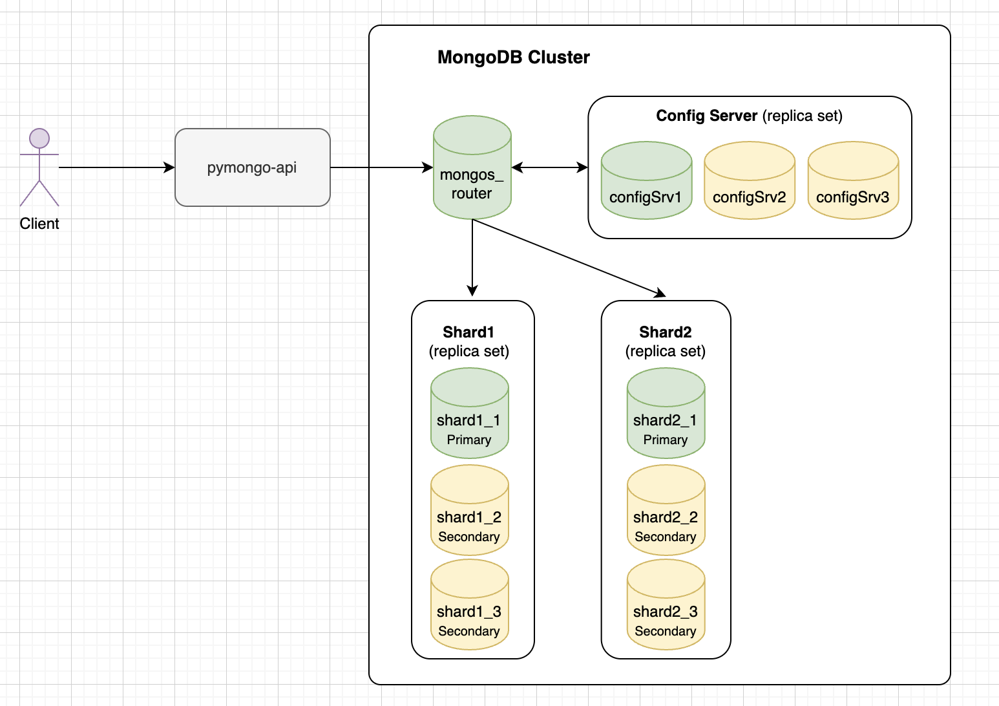

# Задание 3. Репликация

### Состав кластера

- **Config Server**: репликасет из 3 узлов (`configSrv1`, `configSrv2`, `configSrv3`)
- **Shard 1**: репликасет из 3 узлов (`shard1_1`, `shard1_2`, `shard1_3`)
- **Shard 2**: репликасет из 3 узлов (`shard2_1`, `shard2_2`, `shard2_3`)
- **Маршрутизатор mongos**: 1 узел (`mongos_router`)
- **API сервис**: `pymongo_api`



### Запуск

```bash
docker compose up -d
```

### Автоматическая инициализация

Нужно подождать какое-то время после запуска, пока все сервисы полноценно поднимутся, иначе могут быть ошибки, например:
```
MongoNetworkError: connect ECONNREFUSED 127.0.0.1:27018
```

Для быстрой настройки шардирования и репликации выполните:

```bash
sh ./scripts/init-replication.sh
```
