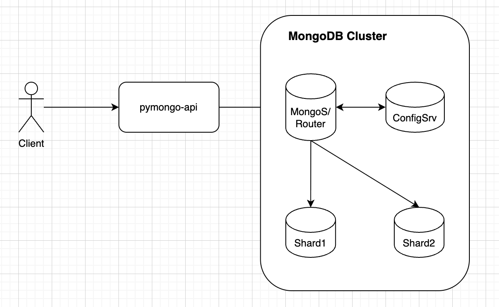

## Задание 2. Шардирование



Выполните следующие команды по порядку.

### 0. Запустить

```bash
docker compose up -d
```

### 1. Инициализация Config Server

```bash
docker exec -it configSrv mongosh --port 27017 --eval "
  rs.initiate({
    _id: 'config_server',
    configsvr: true,
    members: [{ _id: 0, host: 'configSrv:27017' }]
  })
"
```

### 2. Инициализация шарда 1

```bash
docker exec -it shard1 mongosh --port 27018 --eval "
  rs.initiate({
    _id: 'shard1',
    members: [{ _id: 0, host: 'shard1:27018' }]
  })
"
```

### 3. Инициализация шарда 2

```bash
docker exec -it shard2 mongosh --port 27019 --eval "
  rs.initiate({
    _id: 'shard2',
    members: [{ _id: 0, host: 'shard2:27019' }]
  })
"
```

### 4. Добавление шардов в маршрутизатор

```bash
docker exec -it mongos_router mongosh --port 27020 --eval "
  sh.addShard('shard1/shard1:27018');
  sh.addShard('shard2/shard2:27019');
"
```

### 5. Включение шардирования для базы данных и коллекции

```bash
docker exec -it mongos_router mongosh --port 27020 --eval "
  sh.enableSharding('somedb');
  sh.shardCollection('somedb.helloDoc', { _id: 'hashed' });
"
```

### 6. Проверка после инициализации

```bash
docker exec -it shard1 mongosh --port 27018 --eval "rs.status()"
docker exec -it shard2 mongosh --port 27019 --eval "rs.status()"
docker exec -it mongos_router mongosh --port 27020 --eval "sh.status()"
```

### 7. Заполнение базы тестовыми данными

```bash
docker exec -i mongos_router mongosh --port 27020 --eval --quiet <<EOF
  use somedb
  for (var i = 0; i < 1000; i++) {
    db.helloDoc.insertOne({ age: i, name: 'ly' + i })
  }
EOF
```

### 8. Проверить распределение данных по шардам
```bash
docker exec -i mongos_router mongosh --port 27020 --eval --quiet <<EOF
  use somedb
  db.helloDoc.getShardDistribution()
EOF
```

