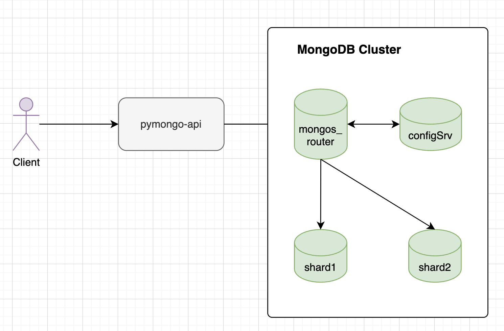

# Задание 2. Шардирование

### Состав кластера

- **Config Server**: 1 узел (`configSrv`)
- **Shard 1**: 1 узел (`shard1`)
- **Shard 2**: 1 узел (`shard2`)
- **Маршрутизатор mongos**: 1 узел (`mongos_router`)
- **API сервис**: `pymongo_api`



### Запуск

```bash
docker compose up -d
```

### Автоматическая инициализация

Нужно подождать какое-то время после запуска, пока все сервисы полноценно поднимутся, иначе могут быть ошибки, например:
```
MongoNetworkError: connect ECONNREFUSED 127.0.0.1:27018
```

Для быстрой настройки шардирования выполните:

```bash
sh ./scripts/init-sharding.sh
```

## Ручная инициализация по шагам

### 1. Инициализация Config Server

```bash
docker exec -it configSrv mongosh --port 27017 --eval "
  rs.initiate({
    _id: 'config_server',
    configsvr: true,
    members: [{ _id: 0, host: 'configSrv:27017' }]
  })
"
```

### 2. Инициализация шарда 1

```bash
docker exec -it shard1 mongosh --port 27018 --eval "
  rs.initiate({
    _id: 'shard1',
    members: [{ _id: 0, host: 'shard1:27018' }]
  })
"
```

### 3. Инициализация шарда 2

```bash
docker exec -it shard2 mongosh --port 27019 --eval "
  rs.initiate({
    _id: 'shard2',
    members: [{ _id: 0, host: 'shard2:27019' }]
  })
"
```

### 4. Добавление шардов в маршрутизатор

```bash
docker exec -it mongos_router mongosh --port 27020 --eval "
  sh.addShard('shard1/shard1:27018');
  sh.addShard('shard2/shard2:27019');
"
```

### 5. Включение шардирования для базы данных и коллекции

```bash
docker exec -it mongos_router mongosh --port 27020 --eval "
  sh.enableSharding('somedb');
  sh.shardCollection('somedb.helloDoc', { _id: 'hashed' });
"
```

### 6. Проверка после инициализации

```bash
docker exec -it shard1 mongosh --port 27018 --eval "rs.status()"
docker exec -it shard2 mongosh --port 27019 --eval "rs.status()"
docker exec -it mongos_router mongosh --port 27020 --eval "sh.status()"
```

### 7. Заполнение базы тестовыми данными

```bash
docker exec -it mongos_router mongosh --port 27020 --eval "
  db = db.getSiblingDB('somedb');
  for (var i = 0; i < 1000; i++) {
    db.helloDoc.insertOne({ age: i, name: 'ly' + i });
  }
  print('Inserted ' + db.helloDoc.countDocuments() + ' documents');
"
```

### 8. Проверка распределение данных по шардам
```bash
docker exec -it mongos_router mongosh --port 27020 --eval "
  db = db.getSiblingDB('somedb');
  var stats = db.helloDoc.getShardDistribution();
  if (stats) {
    printjson(stats);
  } else {
    print('Метод getShardDistribution не сработал, проверяем вручную:');
  }
"
```

### 9. Ручная проверка количества документов на каждом шарде
```bash
docker exec -it shard1 mongosh --port 27018 --eval "db.getSiblingDB('somedb').helloDoc.countDocuments()"
docker exec -it shard2 mongosh --port 27019 --eval "db.getSiblingDB('somedb').helloDoc.countDocuments()"
```

